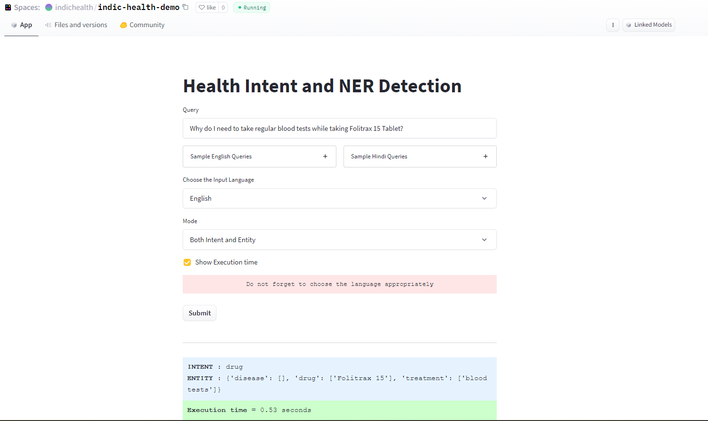

# Intent Identification and Entity Extraction for Healthcare Queries in Indic Languages

This repository represents the paper "Intent Identification and Entity Extraction for Healthcare Queries in Indic Languages", submitted in EACL 2023.

* Try the DEMO: Hosted on [HUGGING FACE SPACES](https://huggingface.co/spaces/indichealth/indic-health-demo)

**Note**:
* Due to space constraints, the demo is currently live only for English and Hindi Languages. We will make it available for other languages once the paper gets accepted.
* We will make the whole dataset/relevant code publicly available once our paper gets accepted.
         
